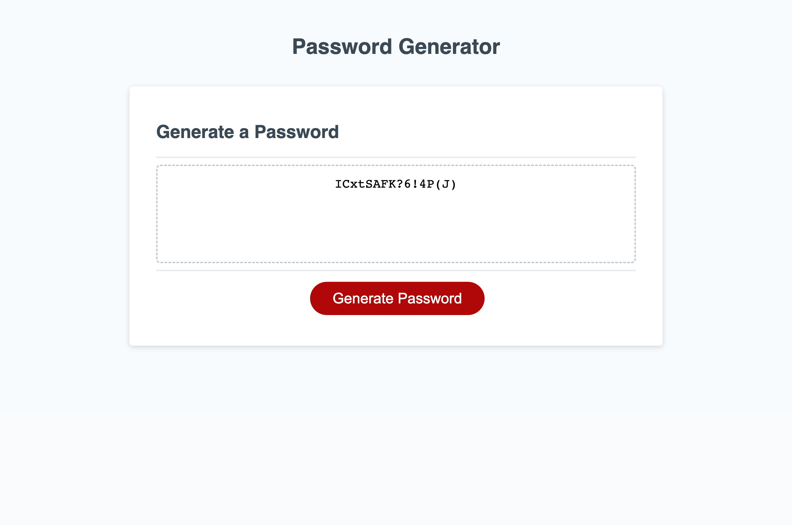

# Pass-Gen

## Description
This project was geared towards JavaScript variables and the sole purpose was to help the user in generating a randomized password. The password is composed of randomized  uppercase letters, characters, numbers, and lowercase letters.

## Installation
N/A

## Useage

## License
N/A

## Screenshot

